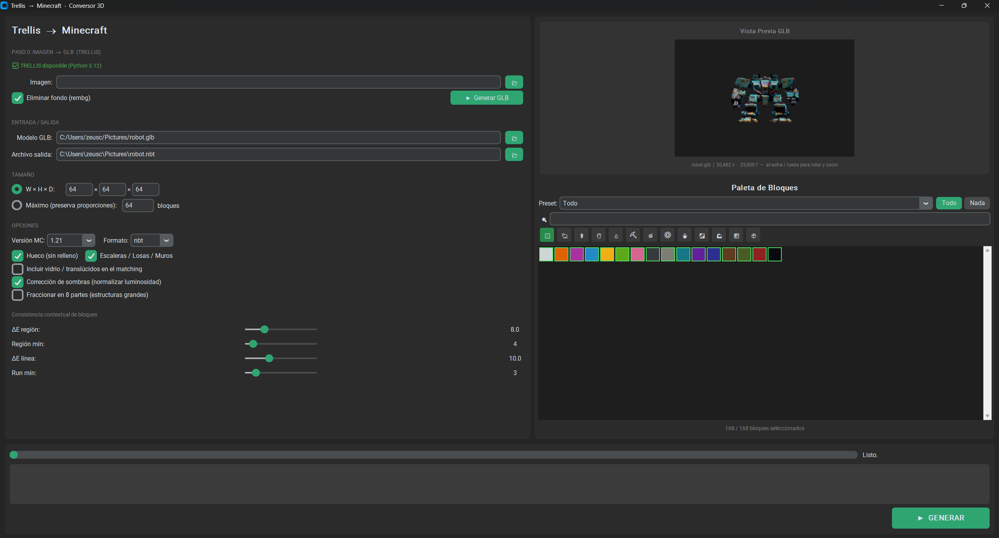

# Minecraft Splatting 🎮

Convert any image or 3D model into a **Minecraft structure** (.nbt / .schem) using [TRELLIS](https://github.com/microsoft/TRELLIS) as the AI 3D reconstruction backend.

  

---

## What it does

1. **Image → 3D model** — Feed a photo or AI-generated image into TRELLIS; it generates a textured GLB mesh.
2. **3D model → Voxels** — The mesh is voxelized to any target block size (e.g. 32×32×32).
3. **Voxels → Minecraft blocks** — Each voxel's color is matched to the closest Minecraft block using perceptual color distance (CIE LAB + KD-Tree).
4. **Export** — Output as `.nbt` (Structure Block / Create mod) or `.schem` (WorldEdit / Litematica).

---

## Features

- **Interactive GUI** built with CustomTkinter
- **3D GLB preview** with mouse drag rotation and scroll zoom
- **TRELLIS integration** — runs the AI pipeline in a separate Python 3.12 subprocess
- **Perceptual color matching** — CIE LAB color space + KD-Tree for fast, accurate block selection
- **3-pass contextual consistency**:
  - Flood-fill region segmentation (groups similar-color adjacent voxels)
  - Horizontal run consistency (smooths same-material lines)
- **Shadow removal** — CLAHE luminosity normalization to compensate baked shadows in TRELLIS textures
- **Shape variants** — automatic stairs, slabs and walls based on voxel geometry
- **Transparent block support** — glass and translucent blocks for semi-transparent zones
- **Structure splitting** — fracture into 8 spatial octants for large builds (bypasses the 250 KB NBT limit in Create mod)
- **Minecraft version selector** (1.20.1 → 1.21.4)
- **Block palette editor** — enable/disable individual blocks or use presets

---

## Requirements

### GUI / Python 3.13 environment

```
customtkinter>=5.2
trimesh>=4.0
Pillow>=10.0
numpy
scipy
scikit-image
nbtlib
```

Install into the `.venv` virtual environment:

```bash
python -m venv .venv
.venv\Scripts\activate
pip install customtkinter trimesh Pillow numpy scipy scikit-image nbtlib
```

### TRELLIS (Python 3.12 environment)

TRELLIS requires Python 3.12 and its own dependencies (PyTorch, spconv, etc.).  
Follow the official setup: https://github.com/microsoft/TRELLIS

Expected install path: `C:\Users\<user>\TRELLIS`

> **Note:** `flash_attn` and `xformers` are **not required**. This project patches TRELLIS sparse attention to use PyTorch native SDPA (`torch.nn.functional.scaled_dot_product_attention`).

---

## Setup

```bash
git clone https://github.com/zeuscabanas/Minecraft_splatting.git
cd Minecraft_splatting
python -m venv .venv
.venv\Scripts\activate
pip install customtkinter trimesh Pillow numpy scipy scikit-image nbtlib
```

Run the GUI:

```bash
.venv\Scripts\python.exe gui.py
```

---

## Interface



The GUI is divided into two panels: the **left panel** handles all configuration, and the **right panel** shows the 3D preview and the block palette.

---

## Left Panel — Options Reference

### PASO 0: IMAGEN → GLB (TRELLIS)

This section generates a textured 3D model from an image using the TRELLIS AI pipeline.

| Element | Description |
|---|---|
| **TRELLIS disponible** | Green indicator — confirms that TRELLIS is installed and reachable under Python 3.12 |
| **Imagen** | Path to the input image (PNG / JPG). Browse with the folder icon |
| **Eliminar fondo (rembg)** | When checked, automatically removes the image background before sending it to TRELLIS, improving 3D reconstruction quality |
| **Generar GLB** | Runs the TRELLIS pipeline in a background subprocess. The resulting `.glb` file is auto-filled in the input path below |

---

### ENTRADA / SALIDA

| Element | Description |
|---|---|
| **Modelo GLB** | Path to the `.glb` 3D mesh to convert. Can be any GLB file — it does not have to come from TRELLIS |
| **Archivo salida** | Path for the output file (`.nbt` or `.schem`). The extension is set automatically based on the **Formato** option |

---

### TAMAÑO

| Element | Description |
|---|---|
| **W × H × D** | Explicit target dimensions in blocks (Width × Height × Depth). The model is scaled to fit exactly these bounds |
| **Máximo (preserva proporciones)** | Sets the longest axis to the given number of blocks and scales the other two axes proportionally, preserving the model's aspect ratio |

---

### OPCIONES

| Option | Default | Description |
|---|---|---|
| **Versión MC** | 1.21 | Minecraft version selector (1.20.1 → 1.21.4). Affects available block IDs and property names in the output |
| **Formato** | nbt | Output format: `nbt` (Structure Block / Create mod) or `schem` (WorldEdit / Litematica) |
| **Hueco (sin relleno)** | ✅ On | Generates only the outer shell of the model, leaving the interior empty. Turn off for fully solid structures |
| **Escaleras / Losas / Muros** | ✅ On | Allows the block matcher to assign stair, slab and wall variants in addition to full blocks, producing smoother diagonal surfaces |
| **Incluir vidrio / translúcidos** | ☐ Off | Adds glass and other translucent blocks to the matching palette. Useful for models with transparent or glassy zones |
| **Corrección de sombras** | ✅ On | Applies CLAHE luminosity normalization to compensate the baked ambient occlusion / shadows that TRELLIS bakes into textures. Recommended for TRELLIS-generated models |
| **Fraccionar en 8 partes** | ☐ Off | Splits the output into 8 spatial octants, each saved as a separate file. Required for large structures that exceed the 250 KB NBT limit imposed by the Create mod |

---

### Consistencia contextual de bloques

These sliders control a two-pass post-processing step that reduces visual noise by enforcing block consistency across neighbouring voxels.

| Slider | Default | Description |
|---|---|---|
| **ΔE región** | 8.0 | Maximum CIE LAB color distance for two adjacent voxels to be considered the same region. Lower values create more, smaller regions; higher values merge more voxels into large regions |
| **Región mín** | 4 | Minimum number of voxels a flood-fill region must have to trigger a consistency vote. Regions smaller than this are left unchanged |
| **ΔE línea** | 10.0 | Maximum color distance for a horizontal run of voxels to be treated as a single material line. Applied in a second pass after region consistency |
| **Run mín** | 3 | Minimum run length (in voxels) before the run consistency pass forces all voxels in the run to the majority block type |

> **Tip:** Set both ΔE sliders to 0 and both min sliders to a very large number to disable consistency entirely and keep the raw per-voxel color match.

---

### Progress bar and status

The bar at the bottom fills during conversion. The label on the right shows the current step (`Listo.` when done, or an error message if something went wrong). All `[VOX]` diagnostic messages from the voxelizer are printed to the log area below the bar.

---

## Right Panel — Reference

### Vista Previa GLB

Interactive 3D viewer for the loaded GLB file.

| Interaction | Action |
|---|---|
| **Left-click drag** | Rotate the model |
| **Scroll wheel** | Zoom in / out |

The status line below the viewer shows the file name, vertex count and face count.

### Paleta de Bloques

Controls which Minecraft blocks are available for color matching.

| Element | Description |
|---|---|
| **Preset** | Load a predefined block set (e.g. *Todo*, or material-specific presets) |
| **Todo / Nada** | Enable or disable all blocks at once |
| **Category icons** | Filter the list by material category (stone, wood, metal, glass, etc.) |
| **Search bar** | Type to filter blocks by name |
| **Color swatches** | Each swatch represents one enabled block. Click to toggle individual blocks on/off |
| **Counter** | Shows how many blocks are currently enabled out of the total available |

---

## Usage

### Step 1 — Generate the GLB (optional, TRELLIS)
1. Select an input image with **Imagen**
2. Optionally enable **Eliminar fondo** to strip the background
3. Click **Generar GLB** — the AI pipeline runs in the background
4. When done the GLB path is auto-filled and the 3D preview updates

### Step 2 — Configure and generate
1. Confirm or change the **Modelo GLB** path
2. Set the **Archivo salida** path
3. Choose **W × H × D** or **Máximo** size mode
4. Adjust options (hollow, shadows, consistency…)
5. Select the desired blocks in the **Paleta de Bloques**
6. Click **GENERAR**

### Loading in Minecraft
- `.nbt` → place with a **Structure Block** (Load mode) or use [Create mod](https://modrinth.com/mod/create) schematic cannon
- `.schem` → import with **WorldEdit** (`//schem load`) or **Litematica**

---

## Project Structure

```
trellis-to-minecraft/
├── gui.py                  # Main GUI application (CustomTkinter)
├── main.py                 # CLI entrypoint
├── src/
│   ├── trellis_runner.py   # Subprocess bridge → TRELLIS Python 3.12
│   ├── trellis_worker.py   # TRELLIS pipeline worker (runs under py -3.12)
│   ├── glb_loader.py       # GLB → trimesh loader
│   ├── voxelizer.py        # Mesh → VoxelGrid + shadow removal
│   ├── block_matcher.py    # Color → Minecraft block (KD-Tree + consistency)
│   ├── nbt_writer.py       # VoxelGrid → .nbt + octant splitter
│   ├── schem_writer.py     # VoxelGrid → .schem (Sponge v3)
│   ├── block_colors.py     # Minecraft block color database
│   └── texture_cache.py    # Texture caching utilities
└── texture_cache.py
```

---

## TRELLIS Patches

This project patches 4 files inside the TRELLIS installation to add SDPA attention backend support (required when `flash_attn` / `xformers` are not installed):

| File | Change |
|---|---|
| `trellis/modules/sparse/__init__.py` | Accept `'sdpa'` as valid attention backend |
| `trellis/modules/sparse/attention/full_attn.py` | SDPA compute path |
| `trellis/modules/sparse/attention/serialized_attn.py` | SDPA compute path (uniform + variable length) |
| `trellis/modules/sparse/attention/windowed_attn.py` | SDPA compute path (uniform + variable length) |

---

## License

[Creative Commons Attribution-NonCommercial 4.0 International (CC BY-NC 4.0)](LICENSE)

Free to use, share and adapt for non-commercial purposes with attribution.  
For commercial use, contact the author.

---

## Acknowledgements

- [TRELLIS](https://github.com/microsoft/TRELLIS) by Microsoft Research — 3D generation model
- [trimesh](https://github.com/mikedh/trimesh) — mesh processing
- [nbtlib](https://github.com/vberlier/nbtlib) — NBT file format
- [CustomTkinter](https://github.com/TomSchimansky/CustomTkinter) — modern Tkinter UI
